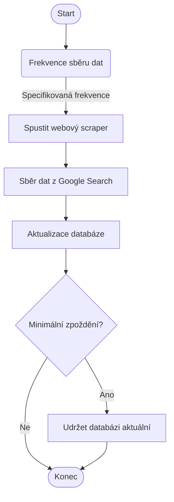
```mermaid
flowchart TD
    start([Start]) --> schedule(Frekvence sběru dat)
    schedule -->|Specifikovaná frekvence| scraper[Spustit webový scraper]
    scraper --> collectData[Sběr dat z Google Search]
    collectData --> updateDB[Aktualizace databáze]
    updateDB --> delay{Minimální zpoždění?}
    delay -->|Ano| keepUpdated[Udržet databázi aktuální]
    delay -->|Ne| finish([Konec])
    keepUpdated --> finish
```

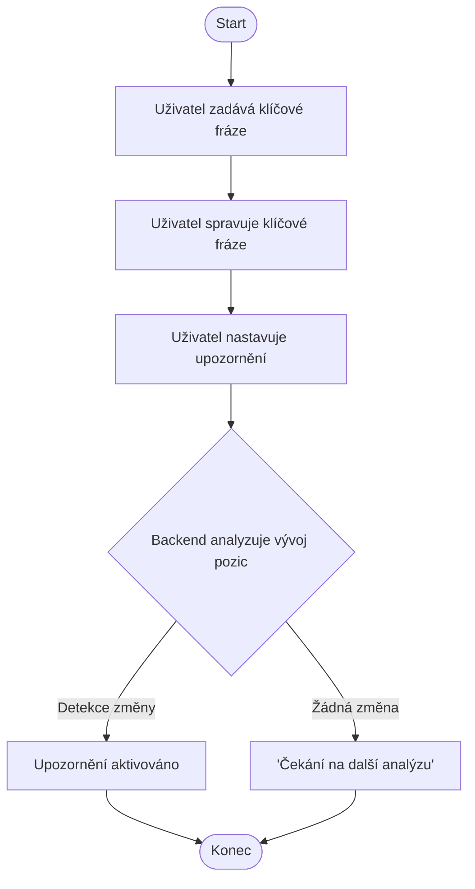
```mermaid
flowchart TD
    start([Start]) --> userInput[Uživatel zadává klíčové fráze]
    userInput --> manageKeywords[Uživatel spravuje klíčové fráze]
    manageKeywords --> setAlerts[Uživatel nastavuje upozornění]
    setAlerts --> backendAnalysis{Backend analyzuje vývoj pozic}
    backendAnalysis -->|Detekce změny| alertTriggered[Upozornění aktivováno]
    backendAnalysis -->|Žádná změna| idle['Čekání na další analýzu']
    alertTriggered --> End([Konec])
    idle --> End([Konec])
```

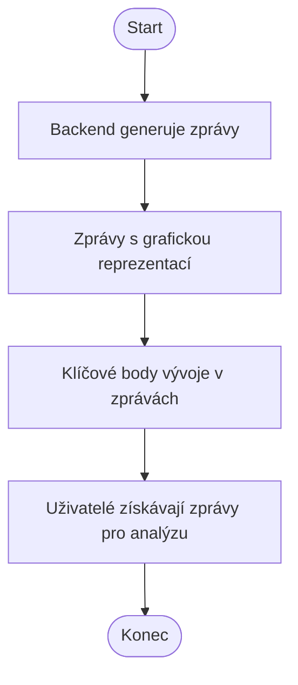
```mermaid
flowchart TD
    start([Start]) --> generateReports[Backend generuje zprávy]
    generateReports --> graphicalRepresentation[Zprávy s grafickou reprezentací]
    graphicalRepresentation --> keyDevelopmentPoints[Klíčové body vývoje v zprávách]
    keyDevelopmentPoints --> userAccess[Uživatelé získávají zprávy pro analýzu]
    userAccess --> End([Konec])
```

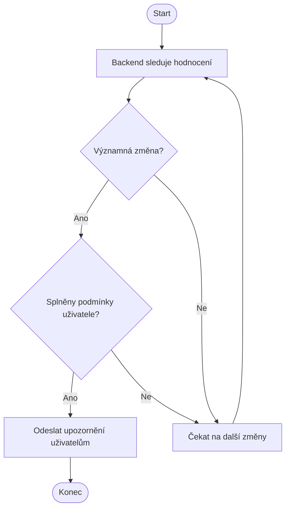
```mermaid
flowchart TD
    start([Start]) --> monitorChange[Backend sleduje hodnocení]
    monitorChange --> significantChange{Významná změna?}
    significantChange -- Ano --> userDefinedCriteria{Splněny podmínky uživatele?}
    userDefinedCriteria -- Ano --> sendAlert[Odeslat upozornění uživatelům]
    userDefinedCriteria -- Ne --> waitForChange[Čekat na další změny]
    significantChange -- Ne --> waitForChange
    waitForChange --> monitorChange
    sendAlert --> End([Konec])
```

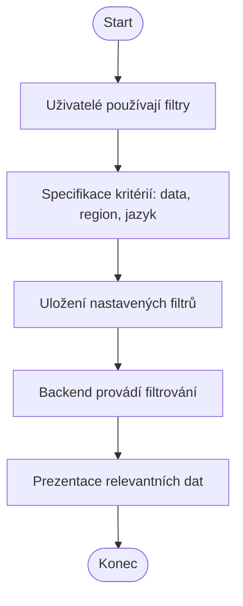
```mermaid
flowchart TD
    start([Start]) --> useFilters[Uživatelé používají filtry]
    useFilters --> specifyCriteria[Specifikace kritérií: data, region, jazyk]
    specifyCriteria --> saveFilters[Uložení nastavených filtrů]
    saveFilters --> backendFiltering[Backend provádí filtrování]
    backendFiltering --> presentData[Prezentace relevantních dat]
    presentData --> End([Konec])
```

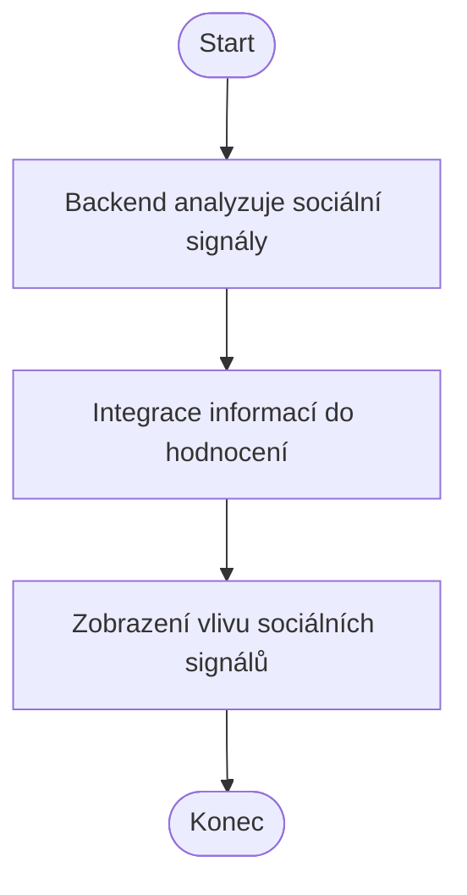
```mermaid
flowchart TD
    start([Start]) --> analyzeSocialSignals[Backend analyzuje sociální signály]
    analyzeSocialSignals --> integrateInformation[Integrace informací do hodnocení]
    integrateInformation --> showImpact[Zobrazení vlivu sociálních signálů]
    showImpact --> End([Konec])
```

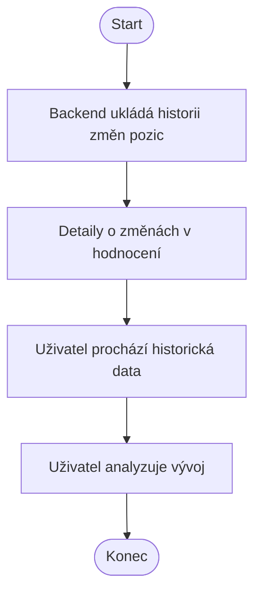
```mermaid
flowchart TD
    start([Start]) --> storeHistory[Backend ukládá historii změn pozic]
    storeHistory --> userDetails[Detaily o změnách v hodnocení]
    userDetails --> userAccess[Uživatel prochází historická data]
    userAccess --> analyzeDevelopment[Uživatel analyzuje vývoj]
    analyzeDevelopment --> End([Konec])
```

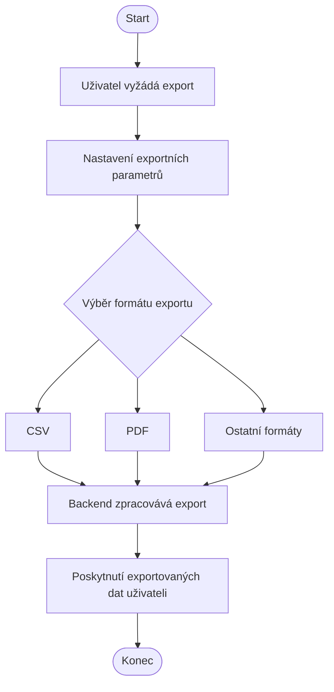
```mermaid
flowchart TD
    start([Start]) --> userRequest[Uživatel vyžádá export]
    userRequest --> setParameters[Nastavení exportních parametrů]
    setParameters --> selectFormat{Výběr formátu exportu}
    selectFormat --> CSV[CSV]
    selectFormat --> PDF[PDF]
    selectFormat --> other[Ostatní formáty]
    CSV --> backendProcess[Backend zpracovává export]
    PDF --> backendProcess
    other --> backendProcess
    backendProcess --> provideData[Poskytnutí exportovaných dat uživateli]
    provideData --> End([Konec])
```

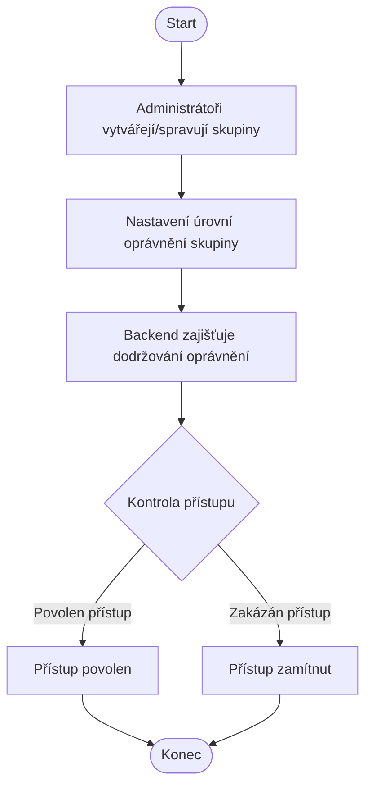
```mermaid
flowchart TD
    start([Start]) --> createGroups[Administrátoři vytvářejí/spravují skupiny]
    createGroups --> setPermissions[Nastavení úrovní oprávnění skupiny]
    setPermissions --> backendEnforcement[Backend zajišťuje dodržování oprávnění]
    backendEnforcement --> accessControl{Kontrola přístupu}
    accessControl -->|Povolen přístup| grantAccess[Přístup povolen]
    accessControl -->|Zakázán přístup| denyAccess[Přístup zamítnut]
    grantAccess --> End([Konec])
    denyAccess --> End
```

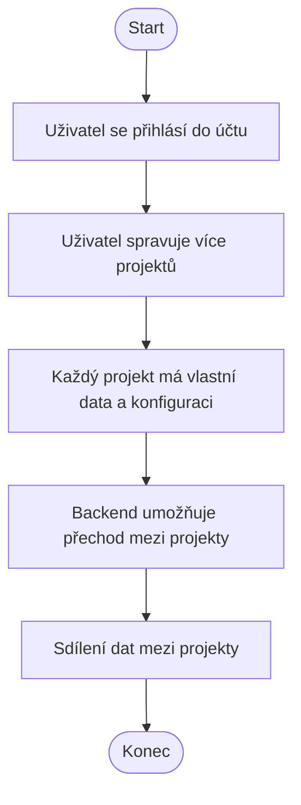
```mermaid
flowchart TD
    start([Start]) --> loginUser[Uživatel se přihlásí do účtu]
    loginUser --> manageProjects[Uživatel spravuje více projektů]
    manageProjects --> projectSeparation[Každý projekt má vlastní data a konfiguraci]
    projectSeparation --> switchProjects[Backend umožňuje přechod mezi projekty]
    switchProjects --> shareData[Sdílení dat mezi projekty]
    shareData --> End([Konec])
```

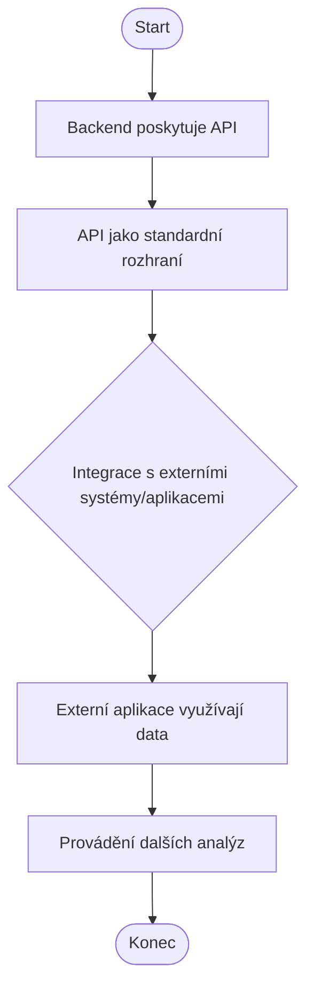
```mermaid
flowchart TD
    start([Start]) --> provideAPI[Backend poskytuje API]
    provideAPI --> standardInterface[API jako standardní rozhraní]
    standardInterface --> externalIntegration{Integrace s externími systémy/aplikacemi}
    externalIntegration --> useData[Externí aplikace využívají data]
    useData --> performAnalysis[Provádění dalších analýz]
    performAnalysis --> End([Konec])
```
